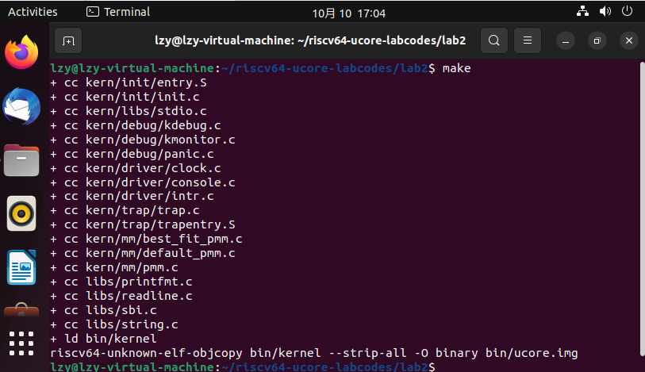

# lab 2
## 练习1：理解first-fit 连续物理内存分配算法
实验内容：first-fit 连续物理内存分配算法作为物理内存分配一个很基础的方法，需要同学们理解它的实现过程。请大家仔细阅读实验手册的教程并结合kern/mm/default_pmm.c中的相关代码，认真分析default_init，default_init_memmap，default_alloc_pages， default_free_pages等相关函数，并描述程序在进行物理内存分配的过程以及各个函数的作用。 

**编译运行lab2工程代码**

### **练习一**

实验内容：first-fit 连续物理内存分配算法作为物理内存分配一个很基础的方法，需要同学们理解它的实现过程。请大家仔细阅读实验手册的教程并结合kern/mm/default_pmm.c中的相关代码，认真分析default_init，default_init_memmap，default_alloc_pages， default_free_pages等相关函数，并描述程序在进行物理内存分配的过程以及各个函数的作用。 请在实验报告中简要说明你的设计实现过程。请回答如下问题：
你的first fit算法是否有进一步的改进空间？

**first-fit连续物理内存分配算法**

在First-Fit连续物理内存分配算法中，空间配置器allocator保留一个空闲列表。接收到内存分配请求后，将沿着列表扫描第一个足够大以满足请求的块，并进行拆分，剩余的块作为新的空闲块加入到列表当中。

### ***算法设计的实现***

### page结构体

在文件kern/mm/memlayout.h中定义page页结构体

    struct Page {
        int ref;                 // page frame's reference counter
        uint32_t flags;          // array of flags that describe the status of the page frame
        unsigned int property;   // the num of free block, used in first fit pm manager
        list_entry_t page_link;  // free list link
    };

ref:表示映射此物理页的虚拟页个数

flags：表示此物理页的状态标记，在kern/mm/memlayout.h中进行了如下定义

    /* Flags describing the status of a page frame */
    #define PG_reserved 0  // the page descriptor is reserved for kernel or unusable
    #define PG_property 1  // the member 'property' is valid

表明flags目前用到了两个bit表示页目前具有的两种属性，bit 0表示此页是否被保留，bit 0为1时表明是被保留的页，不能被动态分配与释放。bit 1表示此页是否是空闲的，若bit 1为1则说明该页是空闲的，可以被分配，若bit 1为0则说明该页已经被分配，无法二次分配。

property：用来记录地址连续的空闲页的个数，用到此成员变量的Page，是这个连续内存空闲块地址最小的一页，连续内存空闲块利用这个页的成员变量property来记录在此块内的空闲页的个数。

page_link：这是便于把多个连续内存空闲块链接在一起的双向链表指针，用到此成员变量的这个Page，是这个连续内存空闲块地址最小的一页。

### **管理所有的连续内存空闲块的双向链表结构free_area_t：**

为了有效地管理众多小连续内存空闲块，可用一个双向链表管理起来，便于分配和释放，为此定义了一个free_area_t数据结构，包含了一个list_entry结构的双向链表指针和记录当前空闲页的个数的无符号整型变量nr_free。其中的链表指针指向了空闲的物理页。

    /* free_area_t - maintains a doubly linked list to record free (unused) pages */
    typedef struct {
        list_entry_t free_list;  // the list header
        unsigned int nr_free;    // # of free pages in this free list
    } free_area_t;

### **物理内存页管理器框架pmm_manager：**

    struct pmm_manager {
        const char *name; //物理内存页管理器的名字
        void (*init)(void); //初始化内存管理器
        void (*init_memmap)(struct Page *base, size_t n); //初始化管理空闲内存页的数据结构
        struct Page *(*alloc_pages)(size_t n); //分配n个物理内存页
        void (*free_pages)(struct Page *base, size_t n); //释放n个物理内存页
        size_t (*nr_free_pages)(void); //返回当前剩余的空闲页数
        void (*check)(void); //用于检测分配/释放实现是否正确的辅助函数
    };

### **双向链表list结构：**

libs/list.h定义了可挂接任意元素的通用双向链表结构和对应的操作，可以完成对双向链表的初始化/插入/删除等。

*list.h:*

    // 双向链表，包括两个分别指向前一个结点和后一个结点的指针
    struct list_entry {
        struct list_entry *prev, *next;
    };

    // list_entry双向链表和list_entry_t等价
    typedef struct list_entry list_entry_t;

    // 初始化一个新的双向链表，双向链表的表头指针和表尾指针都指向elm，即只有一个结点elm的双向链表
    static inline void list_init(list_entry_t *elm) __attribute__((always_inline));
    // 将结点elm插到链表项listelm的后面
    static inline void list_add(list_entry_t *listelm, list_entry_t *elm) __attribute__((always_inline));
    // 将结点elm插到链表项listelm的前面
    static inline void list_add_before(list_entry_t *listelm, list_entry_t *elm) __attribute__((always_inline));
    // 等价于list_add
    static inline void list_add_after(list_entry_t *listelm, list_entry_t *elm) __attribute__((always_inline));
    // 删除链表项listem
    static inline void list_del(list_entry_t *listelm) __attribute__((always_inline));
    // 返回listelm后面的链表项
    static inline list_entry_t *list_next(list_entry_t *listelm) __attribute__((always_inline));
    // 返回listelm前面的链表项
    static inline list_entry_t *list_prev(list_entry_t *listelm) __attribute__((always_inline));

### **default_init函数：**

    static void
    default_init(void) {
        // 初始化链表
        list_init(&free_list);
        // 将可用内存块数目设置为0
        nr_free = 0;
    }

 作用是初始化free_area_t结构中的free_list，并将nr_free设置为0。free_list用于记录可用内存块，nr_free是可用内存块的总数。

 ### **default_init_memmap函数：**

    static void
    default_init_memmap(struct Page *base, size_t n) {
        // n要大于0
        assert(n > 0);
        // 令p为连续地址的空闲块的起始页
        struct Page *p = base;
        // 将这个空闲块的每个页面初始化
        for (; p != base + n; p ++) {
            // 每次循环首先检查p的PG_reserved位是否设置为1，表示空闲可分配
            assert(PageReserved(p));
            // 设置这一页的flag为0，表示这页空闲
            p->flags = 0;
            // 将这一页的ref设为0，因为这页现在空闲，没有引用
            set_page_ref(p, 0);
            // 如果是空闲块的起始页
            if (p == base) {
                // 空闲块的第一页的连续空页值property设置为块中的总页数
                p->property = n;
                // 将空闲块的第一页的PG_property位设置为1，表示是起始页，可以被用作分配内存
                SetPageProperty(p);
            } else {
                // 设置非起始页的property为0，表示不是起始页
                p->property = 0;
            }
        }
        // 将base->page_link此页链接到free_list中
        list_add_before(&free_list, &(base->page_link));
        // 将空闲页的数目加n
        nr_free += n;
    }

代码运行顺序为：kern_init --> pmm_init --> page_init --> init_memmap --> pmm_manager --> init_memmap

default_init_memmap需要根据page_init函数中传递过来的参数（某个连续地址的空闲块的起始页，页个数）来建立一个连续内存空闲块的双向链表。这里有一个假定page_init函数是按地址从小到大的顺序传来的连续内存空闲块的。链表头是free_area.free_list，链表项是Page数据结构的base->page_link。这样我们就依靠Page数据结构中的成员变量page_link形成了连续内存空闲块列表。

default_init_memmap函数将根据每个物理页帧的情况来建立空闲页链表，且空闲页块应该是根据地址高低形成一个有序链表。

### **default_alloc_pages函数：**

firstfit需要从空闲链表头开始查找最小的地址，通过list_next找到下一个空闲块元素，通过le2page宏可以由链表元素获得对应的Page指针p。通过p->property可以了解此空闲块的大小。如果p->property >= n，说明已经找到。如果p->property < n，则list_next，继续查找。直到list_next == &free_list，这表示找完了一遍了。找到后，就要从新组织空闲块，然后把找到的page返回。

    static struct Page *
    default_alloc_pages(size_t n) {
        // n要大于0
        assert(n > 0);
        // 考虑边界情况，当n大于可以分配的内存数时，直接返回，确保分配不会超出范围，保证软件的鲁棒性
        if (n > nr_free) {
            return NULL;
        }
        struct Page *page = NULL;
        // 指针le指向空闲链表头，开始查找最小的地址
        list_entry_t *le = &free_list;
        // 遍历空闲链表
        while ((le = list_next(le)) != &free_list) {
            // 由链表元素获得对应的Page指针p
            struct Page *p = le2page(le, page_link);
            // 如果当前页面的property大于等于n，说明空闲块的连续空页数大于等于n，可以分配，令page等于p，直接退出
            if (p->property >= n) {
                page = p;
                break;
            }
        }
        // 如果找到了空闲块，进行重新组织，否则直接返回NULL
        if (page != NULL) {
            // 在空闲页链表中删除刚刚分配的空闲块
            list_del(&(page->page_link));
            // 如果可以分配的空闲块的连续空页数大于n
            if (page->property > n) {
                // 创建一个地址为page+n的新物理页
                struct Page *p = page + n;
                // 页面的property设置为page多出来的空闲连续页数
                p->property = page->property - n;
                // 设置p的Page_property位，表示为新的空闲块的起始页
                SetPageProperty(p);
                // 将新的空闲块的页插入到空闲页链表的后面
                list_add(&free_list, &(p->page_link));
            }
            // 剩余空闲页的数目减n
            nr_free -= n;
            // 清除page的Page_property位，表示page已经被分配
            ClearPageProperty(page);
        }
        return page;
    }

### **default_free_pages函数：**

default_free_pages函数的实现其实是default_alloc_pages的逆过程，不过需要考虑空闲块的合并问题。将页面重新链接到空闲列表中，可以将小的空闲块合并到大的空闲块中。

    static void
    default_free_pages(struct Page *base, size_t n) {
        // n要大于0
        assert(n > 0);
        // 令p为连续地址的释放块的起始页
        struct Page *p = base;
        // 将这个释放块的每个页面初始化
        for (; p != base + n; p ++) {
            // 检查每一页的Page_reserved位和Page_property是否都未被设置
            assert(!PageReserved(p) && !PageProperty(p));
            // 设置每一页的flags都为0，表示可以分配
            p->flags = 0;
            // 设置每一页的ref都为0，表示这页空闲
            set_page_ref(p, 0);
        }
        // 释放块起始页的property连续空页数设置为n
        base->property = n;
        // 设置起始页的Page_property位
        SetPageProperty(base);
        // 指针le指向空闲链表头，开始查找最小的地址
        list_entry_t *le = &free_list;
        // 遍历空闲链表，查看能否将释放块合并到合适的页块中
        while ((le = list_next(le)) != &free_list) {
            // 由链表元素获得对应的Page指针p
            p = le2page(le, page_link);
            // 如果释放块在下一个空闲块起始页的前面，那么进行合并
            if (base + base->property == p) {
                // 释放块的连续空页数要加上空闲块起始页p的连续空页数
                base->property += p->property;
                // 清除p的Page_property位，表示p不再是新的空闲块的起始页
                ClearPageProperty(p);
                // 将原来的空闲块删除
                list_del(&(p->page_link));
            }
            // 如果释放块的起始页在上一个空闲块的后面，那么进行合并
            else if (p + p->property == base) {
                // 空闲块的连续空页数要加上释放块起始页base的连续空页数
                p->property += base->property;
                // 清除base的Page_property位，表示base不再是起始页
                ClearPageProperty(base);
                // 新的空闲块的起始页变成p
                base = p;
                // 将原来的空闲块删除
                list_del(&(p->page_link));
            }
        }
        le = &free_list;
        // 遍历空闲链表，将合并好之后的页块加回空闲链表
        while ((le = list_next(le)) != &free_list) {
            // 由链表元素获得对应的Page指针p
            p = le2page(le, page_link);
            // 找到能够方向新的合并块的位置
            if (base + base->property <= p) {
                break;
            }
        }
        // 将空闲页的数目加n
        nr_free += n;
        // 将base->page_link此页链接到le中，插入合适位置
        list_add_before(le, &(base->page_link));
    }

### **firstfit算法的改进**

使用二叉搜索树对地址进行排序，可以降低查找页块时的时间复杂度

将较小的内存块及时合并到其它内存块中，也可以提高空间的利用率

## 练习2：实现寻找虚拟地址对应的页表项（需要编程）

